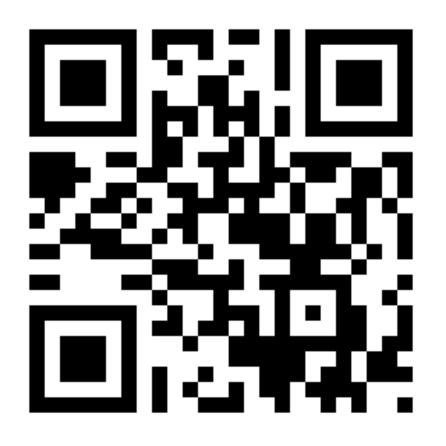
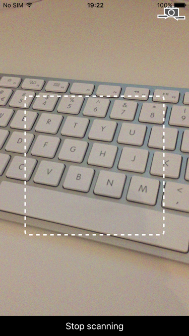
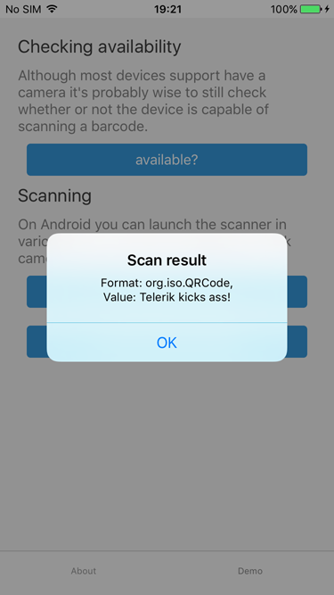
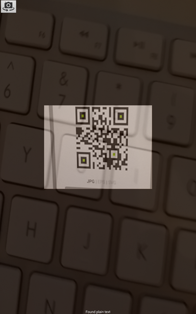
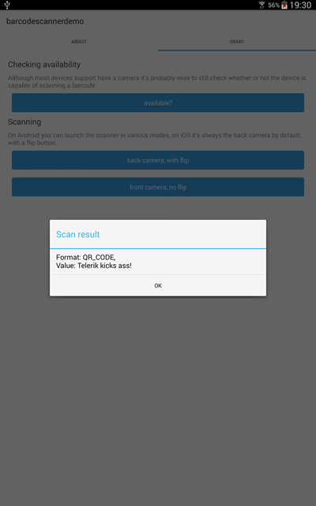

# nativescript-barcodescanner demo app

Demo app for the {N} [barcodescanner plugin](https://www.npmjs.com/package/nativescript-barcodescanner)

## Installation

### Telerik Platform

You can clone this repository in you [Telerik Platform account](https://platform.telerik.com).

### NativeScript CLI
Once you have the [CLI installed](https://github.com/NativeScript/nativescript-cli#installation), start by cloning the repo:

```
$ git clone https://github.com/EddyVerbruggen/nativescript-barcodescanner-demo
$ cd nativescript-barcodescanner-demo
$ cd BarcodeScanner
```

Next, install the app's iOS and Android runtimes, as well as the app's npm dependencies:

```
$ tns install
$ tns install typescript
```

From there you can use the `run` command to run the demo app on iOS:

```
$ tns run ios --emulator
```

.. or on Android

```
$ tns run android --emulator
```

.. or on Android if you have a Genymotion device called `Nexus5X_600`
```
$ tns emulate android --geny Nexus5X_600
```

## Testing
Here, have a QR code:




## Screenshots





